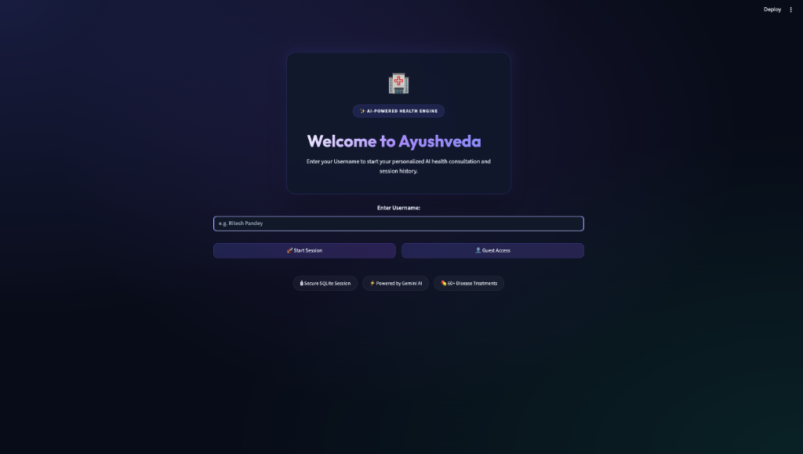
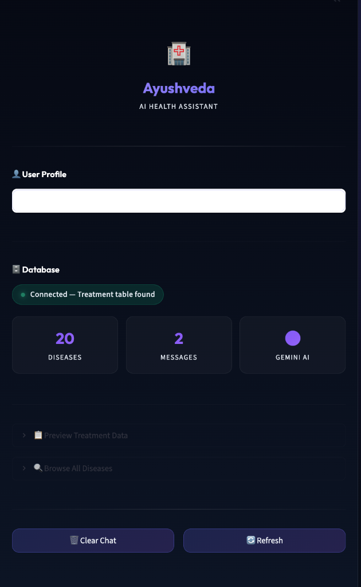
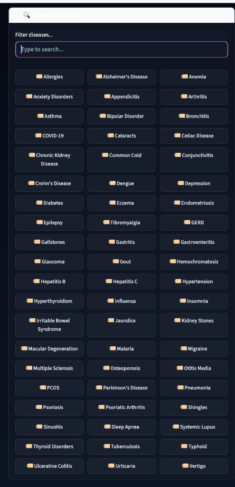

<div align="center">

# Ayushveda (SuggestBot)
### *AI-Powered Disease Treatment Assistant & Health Companion*

[](https://python.org)
[](https://streamlit.io)
[](https://ai.google.dev)
[](https://sqlite.org)
[](LICENSE)

*An intelligent, context-aware medical consultation system that converts natural language queries into structured database lookups and AI-powered treatment guidance.*

---

</div>

##  Table of Contents
- [ Key Features](#-key-features)
- [ Application Screenshots](#️-application-screenshots)
- [ System Architecture](#️-system-architecture)
- [ Project Structure](#-project-structure)
- [ Database Schema](#️-database-schema)
- [ Quick Start & Installation](#-quick-start--installation)
- [ How to Use](#-how-to-use)
- [ Security & Git Best Practices](#️-security--git-best-practices)
- [ Medical Disclaimer](#️-medical-disclaimer)

---

##  Key Features

- ** Google Gemini AI Integration**: Powered by Google's latest Generative AI models (`gemini-flash-latest`, `gemini-3.6-flash`) with automatic candidate fallback handling.
- ** 60+ Medical Conditions Pre-Seeded**: SQLite database pre-loaded with evidence-based treatment guidelines across 9 major medical categories (Neurological, Respiratory, GI, Endocrine, Cardiac, Renal, Musculoskeletal, Dermatology, Ophthalmology).
- ** RapidFuzz Fuzzy Matching**: Intelligent disease extraction pipeline that handles typos, informal phrasing, and contextual disease detection from natural text.
- ** Premium Dark Glassmorphism UI**: Custom CSS design featuring glowing neon accents, vibrant gradient chat bubbles, custom scrollbars, and high-visibility text styling.
- ** Interactive Disease Selector**: Autocomplete dropdown menu and 1-touch clickable disease chips that immediately trigger treatment queries in real time.
- ** Session Persistence & CSV Export**: Multi-user chat history logged directly into SQLite with 1-click CSV file export for offline medical record keeping.
- ** Flexible Onboarding & User Switching**: User profile badges, instant guest mode, and effortless user profile switching.

---

##  Application Screenshots

### 1.  Welcome Onboarding Portal
> *Glassmorphic onboarding card for user authentication and session initialisation.*


### 2.  Dark Glassmorphism Chat Interface
> *Conversational interface with typewriter response animation, gradient user bubbles, and glowing assistant cards.*


### 3.  Interactive 60-Disease Selector Grid
> *Dynamic disease search dropdown and 1-touch interactive prompt chips.*


---

##  System Architecture

```text
                               ┌─────────────────────────┐
                               │       User Query        │
                               └────────────┬────────────┘
                                            │
                                            ▼
                             ┌─────────────────────────────┐
                             │ RapidFuzz Disease Matcher   │
                             └──────────────┬──────────────┘
                                            │
                     ┌──────────────────────┴──────────────────────┐
                     ▼                                             ▼
       ┌───────────────────────────┐                 ┌───────────────────────────┐
       │   Match Found in DB?      │                 │     General Query /       │
       │   (e.g., "Diabetes")      │                 │     Symptom Advice        │
       └─────────────┬─────────────┘                 └─────────────┬─────────────┘
                     │                                             │
                     ▼                                             ▼
       ┌───────────────────────────┐                 ┌───────────────────────────┐
       │  Query Treatment Table    │                 │   Build Chat Memory       │
       │  (SQLite Database)        │                 │   (Last 6 Conversations)  │
       └─────────────┬─────────────┘                 └─────────────┬─────────────┘
                     │                                             │
                     └──────────────────────┬──────────────────────┘
                                            │
                                            ▼
                             ┌─────────────────────────────┐
                             │   Google Gemini AI Engine   │
                             │  (Synthesise Response)      │
                             └──────────────┬──────────────┘
                                            │
                                            ▼
                             ┌─────────────────────────────┐
                             │  Streamlit Dark Glass UI    │
                             │  & SQLite History Storage   │
                             └─────────────────────────────┘
```

---

##  Project Structure

```text
SuggestBot/
├── app.py                   # Main Streamlit web application & Dark Glass UI engine
├── setup_db.py              # SQLite database initialization & 60-disease seed script
├── ritesh.db            # SQLite database instance (Git-ignored)
├── requirements.txt         # Python package dependencies
├── .env                     # Local environment file containing API keys (Git-ignored)
├── .env.example             # Environment configuration template for public setup
├── .gitignore               # Version control exclusion rules (secrets, cache, DBs)
├── README.md                # Comprehensive project documentation
│
├── core/                    # Modular backend engines
│   ├── __init__.py          # Core package initializer
│   ├── ai_engine.py         # Google Gemini API client & fallback response pipeline
│   ├── db_utils.py          # SQLite queries, chat history persistence & CSV export
│   └── disease_matcher.py   # RapidFuzz fuzzy text matcher & disease extractor
│
└── docs/                    # Project documentation & visual assets
    └── images/              # High-resolution application screenshots
        ├── welcome_portal.png
        ├── chatbot_interface.png
        └── disease_browser.png
```

---

##  Database Schema

The application uses an **SQLite3** database (`ritesh.db`) featuring two main tables:

### 1. `Treatment` Table (Medical Knowledge Base)
| Column Name | Data Type | Key Type | Description |
| :--- | :--- | :--- | :--- |
| `Disease` | `TEXT` | **PRIMARY KEY** | Official medical name of the disease condition |
| `treat` | `TEXT` | `NOT NULL` | Evidence-based treatment protocol & lifestyle guidance |

### 2. `ChatHistory` Table (User Conversation Storage)
| Column Name | Data Type | Key Type | Description |
| :--- | :--- | :--- | :--- |
| `id` | `INTEGER` | **PRIMARY KEY** | Auto-incrementing message ID |
| `username` | `TEXT` | `NOT NULL` | Associated user profile or session username |
| `role` | `TEXT` | `NOT NULL` | Message sender (`human` or `ai`) |
| `content` | `TEXT` | `NOT NULL` | Message text content |
| `timestamp` | `DATETIME` | `DEFAULT CURRENT_TIMESTAMP` | Exact message creation timestamp |

---

##  Quick Start & Installation

### Prerequisites
- **Python 3.10+** installed on your machine.
- A **Google Gemini API Key** (Get a free key at [Google AI Studio](https://aistudio.google.com/)).

### 1. Clone the Repository
```bash
git clone https://github.com/riteshpandey2024-cyber/SuggestBot.git
cd SuggestBot
```

### 2. Install Dependencies
```bash
pip install -r requirements.txt
```

### 3. Configure Environment Variables
Create a `.env` file in the root directory (you can copy `.env.example`):
```bash
cp .env.example .env
```
Edit `.env` and paste your Google Gemini API key:
```env
GEMINI_API_KEY=AIzaSyYourActualGeminiApiKeyHere
DB_PATH=ritesh.db
```

### 4. Initialise & Seed Database (60 Diseases)
Run `setup_db.py` once to build `ritesh.db` and populate 60 diseases:
```bash
python3 setup_db.py
```

### 5. Launch the Application
Start the Streamlit web app:
```bash
streamlit run app.py
```
Open your browser and navigate to: `http://localhost:8501`

---

## How to Use

1. **Start a Session**:
   - Enter your Username (e.g. `Ritesh Pandey`) on the Welcome Portal and click **`🚀 Start Session`** (or click **`👤 Guest Access`**).

2. **Querying Treatment Data**:
   - Type any health question into the chat input bar (e.g., *"What is the treatment for Dengue?"* or *"How to manage asthma?"*).
   - The bot automatically matches the disease, retrieves the structured treatment from SQLite, and formats a response using Gemini AI.

3. **Interactive Disease Selector**:
   - Expand **`🔍 Browse & Select Diseases`** in the left sidebar.
   - Pick any disease from the dropdown or click any disease button (` Diabetes`, ` COVID-19`, ` Migraine`) to trigger instant queries.

4. **Export Chat History**:
   - Expand **` Saved Queries & Export`** in the sidebar and click **` Download History (CSV)`** to download your session record.

---

##  Security & Git Best Practices

To ensure private API keys and local databases are never leaked to public repositories, this project enforces strict `.gitignore` rules:

```text
# Staging & Committing Code Changes safely
git add.
git commit -m "Describe your changes here"
git push
```

*Note: Never commit `.env` or `ritesh.db` files directly.*

---

## ⚠️ Medical Disclaimer

> [!IMPORTANT]
> **Ayushveda (SuggestBot)** is designed strictly for **informational and educational purposes only**. It is not a substitute for professional medical advice, diagnosis, or treatment. Always seek the advice of a qualified physician or healthcare professional regarding any medical condition.

---

<div align="center">

Built with ❤️ by **Ritesh Pandey** • Powered by **Streamlit**, **Google Gemini AI** & **SQLite**

</div>
